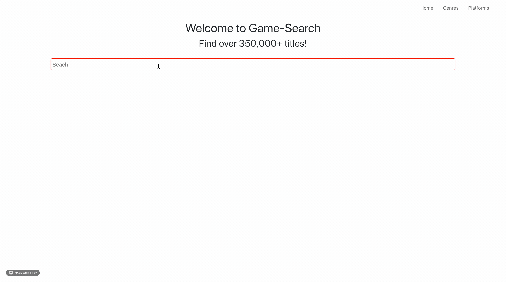

# Game-Search

[Game-Search](https://jrosario22.github.io/game-search/)

Game-Search is a search app for video games. Here you can information on over 350,000 video games.



## Getting Started

These instructions will get you a copy of the project up and running on your local machine for development and testing purposes. See deployment for notes on how to deploy the project on a live system.

### Prerequisites

What you'll need:

```
Node.js
```

### Installing

Be sure to clone the repository on your local machine:

```
git clone https://github.com/jrosario22/game-search.git
```

Once the repository is cloned, you'll want to make the depedencies are installed by running:

```
npm install
```

After updating the dependencies, you can run a local server with:

```
npm start
```

## Built With

- [React](http://www.dropwizard.io/1.0.2/docs/) - The UI framework used
- [RAWG API](https://api.rawg.io/docs/) - API used
- [React-Bootsrap](https://react-bootstrap.github.io/) - Used to style components

## Authors

- **Jeson Rosario** - [jrosario22](https://github.com/jrosario22)

## Acknowledgments

- Prof. Cameron for his guidance and support

---
